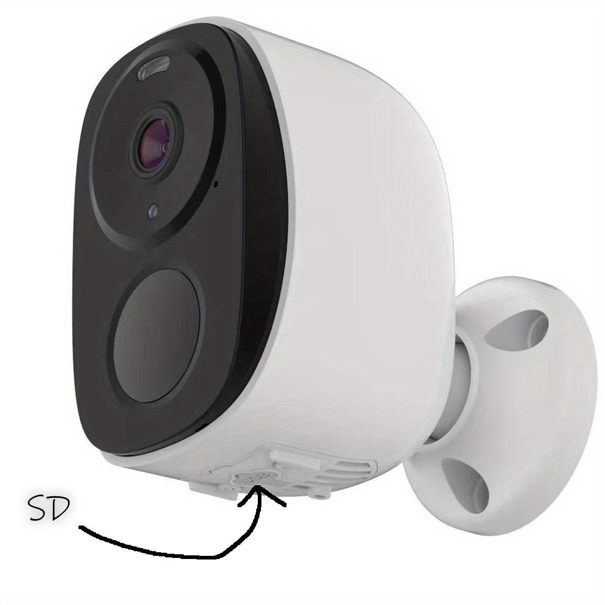
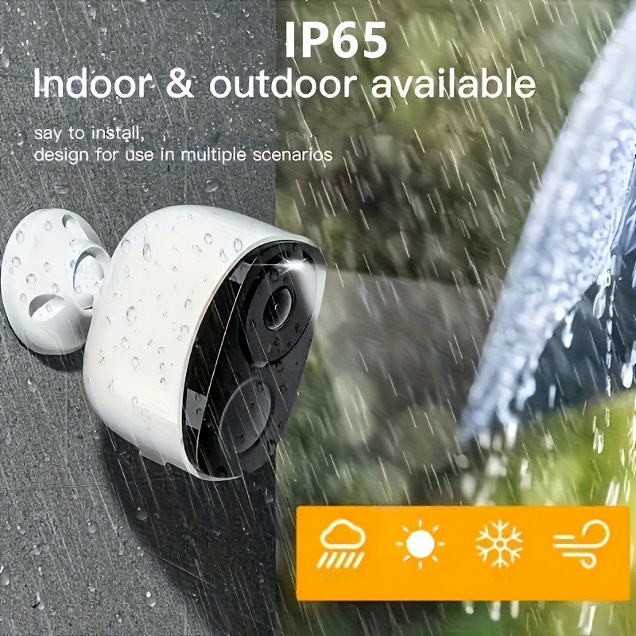
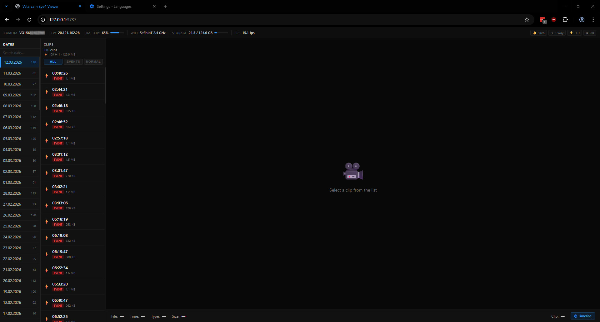
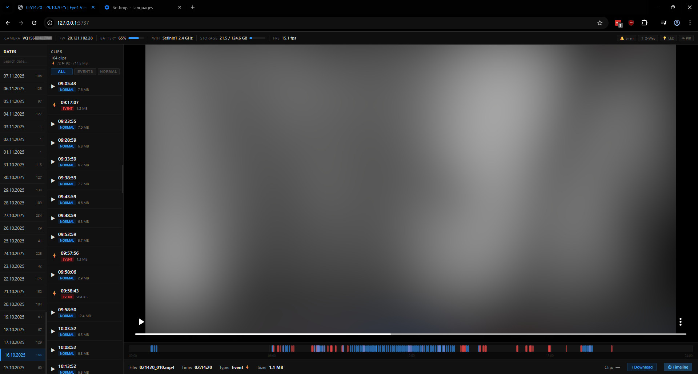
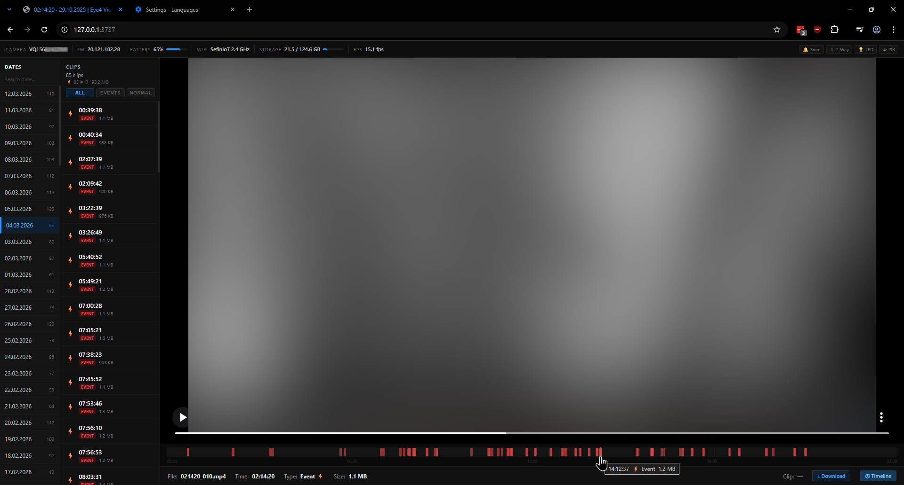

# 🎥 Vstarcam Eye4 Viewer

A local clip viewer for SD cards from **Vstarcam** cameras running on the **Eye4** platform.
No cloud connection required, everything runs within your local network.
I wrote this for myself because the camera itself is honestly not bad, but the **O-KAM Pro** app is clunky. And I really can't be bothered looking for alternatives.

<div align="center">
  
  
</div>


## Preview
<div align="center">
  
  
  
</div>


## Features
- Browse recordings grouped by date
- Filter clips: all / PIR events / normal
- Video playback with seeking support (Range requests)
- Timeline bar with full-day visualization
- Camera info read from SD card: battery, storage, firmware, Wi-Fi, FPS
- Keyboard shortcuts: `Space` pause, `←` `→` previous/next clip, `F` fullscreen
- Remembers the last watched clip (localStorage)
- Download clips directly from the browser


## Requirements
- Node.js 20.6+ [[Windows](https://nodejs.org/en/download/current) | [Linux](https://gist.github.com/sefinek/fb50041a5f456321d58104bbf3f6e649)]
- SD card from a Vstarcam / Eye4 camera connected to your computer


## Setup

### Configuration
Copy `.env.default` and rename it to `.env` in the project directory:

```env
PORT=2026
VIDEO_ROOT=E:\YOUR_DEVICE_ID\video
```

`VIDEO_ROOT` is the path to the `video` folder on the camera's SD card.


### Running
```bash
npm install
npm start
```

Then open [http://127.0.0.1:2026](http://127.0.0.1:2026) in your browser.


## SD Card File Structure
This project expects the following directory layout, which is characteristic of the Eye4 firmware (or whatever it is):

```
VIDEO_ROOT/
└── YYYY-MM-DD/
    ├── s0/
    │   ├── HHMMSS_100.mp4   # normal recording
    │   └── HHMMSS_010.mp4   # PIR event
    └── YYYYMMDD.log
```


## License
Copyright © 2026 [Sefinek](https://sefinek.net)
